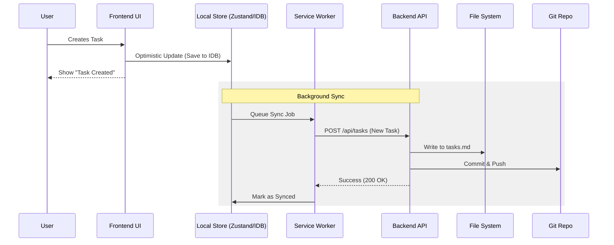

# Scheduler App Architecture Document

<!-- Powered by BMAD™ Core -->

## Introduction

This document outlines the overall project architecture for the Scheduler App, including backend systems, shared services, and non-UI specific concerns. Its primary goal is to serve as the guiding architectural blueprint for AI-driven development, ensuring consistency and adherence to chosen patterns and technologies.

**Relationship to Frontend Architecture:**
Since this project has a significant user interface, this document focuses on the core system architecture, data flow, and backend services. Frontend-specific details (component hierarchy, state management patterns) will be detailed in the Frontend Architecture Document/Specification, but the core technology stack choices documented herein are definitive for the entire project.

### Starter Template or Existing Project

This is an existing project ("Brownfield") that is being enhanced.
- **Current Stack**: React + Vite (Frontend), Express (Backend), TypeScript (Both)
- **State Management**: Zustand
- **UI Library**: shadcn/ui
- **Data Persistence**: Markdown files with Git sync + JSON for schedule

### Change Log

| Date | Version | Description | Author |
|------|---------|-------------|--------|
| 2025-12-01 | 1.0 | Initial Architecture Document created from PRD | BMAD Architect Agent |

---

## High Level Architecture

### Technical Summary

The Scheduler App follows a **Monolithic Client-Server Architecture** with a heavy emphasis on **Local-First** principles. The frontend is a Progressive Web App (PWA) built with React and Vite, capable of offline operation using IndexedDB. The backend is a lightweight Express server that primarily handles file system operations (reading/writing markdown/JSON), Git synchronization, and external API integrations. The system uses a **Repository Pattern** to abstract data access, allowing the frontend to switch between local IndexedDB (offline) and API calls (online) seamlessly.

### High Level Overview

1.  **Architectural Style**: **Local-First Monolith**. The application logic resides primarily in the client (Thick Client), with the server acting as a synchronization gateway and integration point for external services.
2.  **Repository Structure**: **Monorepo**. Both frontend and backend reside in the same repository for easier code sharing (types) and coordinated deployments.
3.  **Service Architecture**: **Monolith**. A single Express server handles all API requests. Future compute-intensive features (AI) may be offloaded to serverless functions if needed, but the core remains monolithic for simplicity.
4.  **Data Flow**:
    -   **Read**: Frontend checks local cache (IndexedDB/Zustand) -> fetches from Server if stale -> Server reads from File System.
    -   **Write**: Frontend updates local cache (Optimistic UI) -> queues sync to Server -> Server writes to File System -> Server commits to Git.
5.  **Key Decisions**:
    -   **Markdown as Database**: Preserving the existing file-based storage allows users to edit data with any text editor and leverages Git for version history.
    -   **Offline-First**: Critical for mobile usage; requires robust sync logic.

### High Level Project Diagram

```mermaid
graph TD
    User[User] -->|Interacts| PWA[React PWA Frontend]
    
    subgraph Client Device
        PWA -->|Read/Write| IDB[(IndexedDB)]
        PWA -->|State Mgmt| Store[Zustand Store]
        PWA -->|Background Sync| SW[Service Worker]
    end
    
    PWA -- REST API --> Server[Express Backend]
    
    subgraph Server
        Server -->|File I/O| FS[File System]
        Server -->|Git Ops| Git[Git Service]
        Server -->|Auth| Auth[Auth Middleware]
        Server -->|External APIs| Ext[Integration Services]
    end
    
    subgraph External Services
        Ext -->|Sync| GCal[Google Calendar]
        Ext -->|Sync| Outlook[Outlook Calendar]
        Ext -->|AI| OpenAI[OpenAI/Claude API]
    end
    
    FS <-->|Version Control| Repo[(Git Repository)]
```

### Architectural and Design Patterns

- **Repository Pattern:** Abstract data access logic on both client and server.
    - _Rationale:_ Allows the frontend to swap between local storage and API calls transparently, and allows the server to swap between file system and potentially a real DB in the future if needed.
- **Optimistic UI Updates:** Update the UI immediately upon user action, then sync in background.
    - _Rationale:_ Essential for a responsive feel, especially with the "Local-First" requirement.
- **Command Pattern:** Encapsulate all data-modifying operations (create task, update status) as commands.
    - _Rationale:_ Facilitates "Undo/Redo" functionality and offline command queueing.
- **Observer Pattern:** Use for the Notification System and Sync Status updates.
    - _Rationale:_ Decouples the event source (e.g., timer finished) from the reaction (show notification).

---

## Tech Stack

### Cloud Infrastructure

- **Provider:** Vercel (Frontend) + Railway/Render (Backend) OR Self-Hosted (User preference for local-first)
- **Key Services:** Node.js Runtime
- **Deployment Regions:** User's local machine (primary) or Cloud (optional)

### Technology Stack Table

| Category | Technology | Version | Purpose | Rationale |
| :--- | :--- | :--- | :--- | :--- |
| **Language** | TypeScript | 5.x | Primary development language | Strong typing, shared types between FE/BE, excellent tooling |
| **Runtime** | Node.js | 20.x (LTS) | JavaScript runtime | Stable, performant, wide ecosystem |
| **Frontend Framework** | React | 18.x | UI Library | Component-based, rich ecosystem, existing project choice |
| **Build Tool** | Vite | 5.x | Bundler | Fast dev server, optimized builds, existing project choice |
| **State Management** | Zustand | 4.x | Client State | Simple, lightweight, supports persistence, existing choice |
| **Backend Framework** | Express | 4.x | API Server | Minimalist, flexible, easy to set up for file ops |
| **UI Component Lib** | shadcn/ui | Latest | UI Components | Accessible, customizable, modern look (Radix UI based) |
| **Styling** | TailwindCSS | 3.x | CSS Framework | Utility-first, rapid development, dark mode support |
| **PWA** | vite-plugin-pwa | Latest | Offline capabilities | Easy integration with Vite for service workers |
| **Local DB** | idb | Latest | Client-side storage | Promise-based wrapper for IndexedDB |
| **Testing** | Vitest | Latest | Unit/Integration Testing | Fast, Vite-native, Jest-compatible |
| **E2E Testing** | Playwright | Latest | End-to-End Testing | Reliable browser automation for critical flows |
| **Git Ops** | simple-git | Latest | Server-side Git operations | programmatic control of git commands |

---

## Data Models

### Task

**Purpose:** Represents a single unit of work or todo item.

**Key Attributes:**
- `id`: string - UUID
- `title`: string - Task description
- `status`: enum - 'todo', 'in-progress', 'done', 'archived'
- `priority`: enum - 'high', 'medium', 'low'
- `dueDate`: ISO8601 string - Optional due date
- `estimatedDuration`: number - Minutes
- `actualDuration`: number - Minutes (tracked)
- `tags`: string[] - Array of tag strings
- `recurrence`: object - Recurrence rules (frequency, interval, end date)
- `projectId`: string - Reference to parent project

**Relationships:**
- Belongs to one Project (optional)
- Can have multiple TimeBlocks (via schedule)

### TimeBlock

**Purpose:** Represents a scheduled slot in the calendar.

**Key Attributes:**
- `id`: string - UUID
- `startTime`: string - HH:mm format
- `endTime`: string - HH:mm format
- `label`: string - Description of the block (e.g., "Deep Work")
- `type`: enum - 'focus', 'meeting', 'break', 'admin'
- `taskId`: string - Optional reference to a specific task

**Relationships:**
- Can contain one Task

### Project

**Purpose:** Groups related tasks together.

**Key Attributes:**
- `id`: string - UUID
- `name`: string - Project name
- `color`: string - Hex color code
- `status`: enum - 'active', 'completed', 'archived'

**Relationships:**
- Has many Tasks

---

## Components

### Frontend Components

**Responsibility:** Handle user interaction, display data, manage local state.

**Key Interfaces:**
- `TaskService` (Client-side adapter)
- `SyncService`

**Dependencies:** Backend API, IndexedDB

**Technology Stack:** React, Zustand, React Router

### Backend API Service

**Responsibility:** Handle file system operations, Git sync, and external API calls.

**Key Interfaces:**
- `GET /api/tasks`
- `POST /api/tasks`
- `POST /api/sync`

**Dependencies:** File System, Git

**Technology Stack:** Express, simple-git

### Notification Service

**Responsibility:** Manage local and push notifications.

**Key Interfaces:**
- `scheduleNotification(task)`
- `cancelNotification(taskId)`

**Dependencies:** Browser Notification API

**Technology Stack:** Web Notifications API

### Sync Engine

**Responsibility:** Handle bidirectional synchronization between Client (IndexedDB) and Server (File System).

**Key Interfaces:**
- `syncQueue()`
- `resolveConflict()`

**Dependencies:** Backend API, IndexedDB

**Technology Stack:** Custom logic + Service Worker

---

## External APIs

### Google Calendar API

- **Purpose:** Sync tasks with Google Calendar events.
- **Authentication:** OAuth 2.0
- **Key Endpoints Used:**
    - `GET /events` - Fetch events
    - `POST /events` - Create event from task
- **Integration Notes:** Need to handle token refresh and rate limiting.

### OpenAI API (Optional - Phase 4)

- **Purpose:** AI suggestions for scheduling.
- **Authentication:** API Key
- **Key Endpoints Used:**
    - `POST /v1/chat/completions` - Generate schedule suggestions
- **Integration Notes:** strictly server-side to protect API keys.

---

## Core Workflows

### Task Creation & Sync Flow



---

## Database Schema

Since we are using **Markdown/JSON files** as the primary source of truth (backed by Git) and **IndexedDB** for client-side caching, the schema definition applies to both the JSON structure in files and the object stores in IndexedDB.

### JSON Structure (tasks.json / IndexedDB 'tasks' store)

```json
{
  "tasks": [
    {
      "id": "uuid-v4",
      "title": "Implement Dark Mode",
      "status": "todo",
      "priority": "high",
      "created_at": "2025-12-01T10:00:00Z",
      "updated_at": "2025-12-01T10:00:00Z",
      "tags": ["ui", "feature"],
      "time_tracking": {
        "estimated": 60,
        "actual": 0,
        "history": []
      }
    }
  ]
}
```

---

## Source Tree

```text
scheduler/
├── .github/                    # GitHub Actions workflows
├── docs/                       # Documentation (PRD, Arch, etc.)
├── server/                     # Backend Application
│   ├── src/
│   │   ├── config/             # Configuration
│   │   ├── controllers/        # Route controllers
│   │   ├── routes/             # API Routes
│   │   ├── services/           # Business logic (Git, File, AI)
│   │   ├── types/              # Backend types
│   │   └── utils/              # Utilities
│   ├── index.ts                # Entry point
│   └── package.json
├── src/                        # Frontend Application
│   ├── assets/                 # Static assets
│   ├── components/             # React components
│   │   ├── ui/                 # shadcn/ui components
│   │   └── ...                 # Feature components
│   ├── hooks/                  # Custom hooks
│   ├── lib/                    # Utilities
│   ├── pages/                  # Page components
│   ├── services/               # API clients & Local services
│   ├── store/                  # Zustand stores
│   ├── types/                  # Shared types (symlinked or copied)
│   ├── App.tsx
│   └── main.tsx
├── shared/                     # Shared types/utils (optional workspace)
├── package.json                # Root package.json
├── tsconfig.json               # Base TS config
└── vite.config.ts              # Vite config
```

---

## Infrastructure and Deployment

### Infrastructure as Code
- **Tool:** None (Simple deployment)
- **Approach:** Manual or Script-based setup for local environment.

### Deployment Strategy
- **Strategy:** Rolling Update (for Web) / Pull (for Local)
- **CI/CD Platform:** GitHub Actions
- **Pipeline Configuration:** `.github/workflows/ci.yml` (Test & Build), `.github/workflows/deploy.yml` (Deploy)

### Environments
- **Development:** Local machine, hot-reloading.
- **Production:** Live URL (e.g., Vercel) or Local Production Build.

---

## Error Handling Strategy

### General Approach
- **Error Model:** Standardized JSON error response for API.
- **Exception Hierarchy:** Base `AppError` class with `statusCode` and `code`.
- **Error Propagation:** Catch at controller level -> Pass to global error handler middleware.

### Logging Standards
- **Library:** `winston` (Backend), `console` (Frontend - Dev only)
- **Format:** JSON in production, pretty print in dev.
- **Levels:** error, warn, info, debug.

---

## Coding Standards

### Core Standards
- **Languages & Runtimes:** TypeScript 5.x, Node 20.x
- **Style & Linting:** ESLint + Prettier (Standard config)
- **Test Organization:** `__tests__` directories or `.test.ts` alongside files.

### Critical Rules
- **No Direct DOM Manipulation:** Always use React refs.
- **Type Safety:** No `any`. Use `unknown` if necessary and narrow types.
- **State Immutability:** Always treat state as immutable (Zustand handles this, but be careful with nested objects).
- **Secure Secrets:** Never commit `.env` files.

---

## Test Strategy and Standards

### Testing Philosophy
- **Approach:** Test-After (feature first, then test) for UI, TDD for complex logic (recurrence, sync).
- **Coverage Goals:** 80% overall.
- **Test Pyramid:** Heavy on Unit/Integration, light on E2E.

### Test Types and Organization
- **Unit Tests:** Vitest. Test individual functions, hooks, and utility classes.
- **Integration Tests:** Vitest + React Testing Library. Test component interactions and store updates.
- **E2E Tests:** Playwright. Test critical flows (Create Task, Sync, Offline mode).

---

## Security

### Input Validation
- **Validation Library:** `zod`
- **Validation Location:** API Controllers (Backend) and Form Inputs (Frontend).
- **Required Rules:** Validate all request bodies and query params against Zod schemas.

### Authentication & Authorization
- **Auth Method:** Simple Token/Password for local, OAuth for Google/Outlook.
- **Session Management:** JWT or Session Cookies.

### Secrets Management
- **Development:** `.env` file (gitignored).
- **Code Requirements:** Access via `process.env` only.

---

## Next Steps

### Architect Prompt

Create a comprehensive Frontend Architecture Document based on this architecture. Focus on:
1.  **Offline Sync Implementation:** Detailed design of the `SyncEngine` and IndexedDB schema.
2.  **State Management:** How Zustand will handle optimistic updates and sync status.
3.  **Component Hierarchy:** Organization of the new feature components (TimeTracking, Analytics).
4.  **PWA Configuration:** Service worker strategy for caching and background sync.
