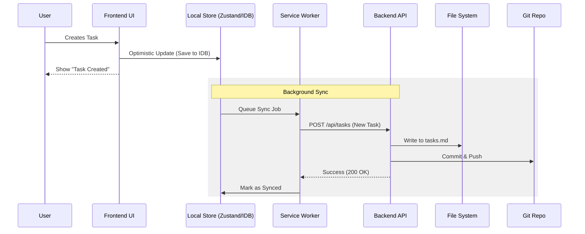

# Core Workflows

## Task Creation & Sync Flow

```mermaid
sequenceDiagram
    participant User
    participant UI as Frontend UI
    participant Store as Local Store (Zustand/IDB)
    participant SW as Service Worker
    participant API as Backend API
    participant FS as File System
    participant Git as Git Repo

    User->>UI: Creates Task
    UI->>Store: Optimistic Update (Save to IDB)
    UI-->>User: Show "Task Created"
    
    rect rgb(240, 240, 240)
        Note over Store, API: Background Sync
        Store->>SW: Queue Sync Job
        SW->>API: POST /api/tasks (New Task)
        API->>FS: Write to tasks.md
        API->>Git: Commit & Push
        API-->>SW: Success (200 OK)
        SW->>Store: Mark as Synced
    end
```

---
